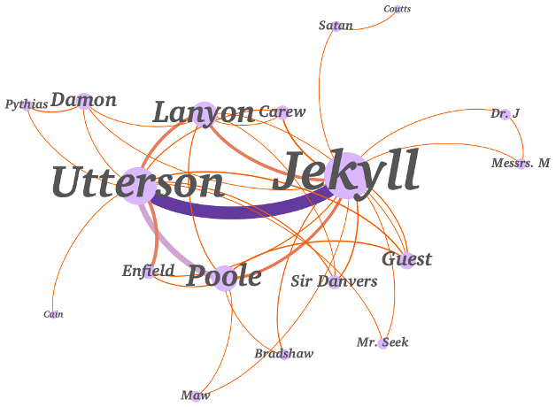

# Fictional Character Identification

This repository features an example processing pipeline for R.L. Stevenson's novel "The Strange Case of Dr. Jekyll and Mr. Hyde". The primary objective is to extract a comprehensive list of characters from the book, group entities by their identity, and generate a visual network that illustrates relationships between different characters based on their co-occurrence at the sentence level.

<strong> Please note that this repository has been developed for study purposes and is associated with an ongoing thesis project. </strong>

## Key Features:
<strong> Character Extraction: Automatically identifies and lists characters from the text.</strong>
<strong> Identity Grouping: Groups characters by their respective identities within the narrative.</strong>
<strong> Network Visualization: Utilizes data to create a visual representation of relationships between characters.</strong>

This pipeline serves as a practical demonstration of text analysis techniques, showcasing how literary data can be structured and analyzed to uncover insights.

In the notebook folder, you will find two notebooks:

  * Fictional Character Identification.ipynb: Contains the code to process books or stories
  * Process Book Pipeline.ipynb: Used to run the previous notebook 

The output is saved in the output folder and produces the following files:

  * A .csv file containing the entities with their clusters of characters
  * A representation of the obtained clusters of characters as a network representation, where each node is an entity and nodes connected and with the same color belong to        the same character
  * The network generated with the NetworkX library for the co-occurrences of characters at sentence level, where edge thickness represents occurrence frequency and node size     represents degree centrality
  * A Gephi .gexf file to generate the same network using the Gephi tool. Particularly useful for books with many characters since the one generated with NetworkX is limited,     like the following obtained for "The Strange Case of Dr. Jekyll and Mr. Hyde" by R.L. Stevenson:

  

  * A representation of the centrality measures with a scatterplot where the color represent the closeness centrality measure
    
To process a book or story (or multiple books/stories), follow these steps:

* Clone the repository
* Install the required dependencies (requirements.txt)
* Place the book(s) in .txt format into the book_to_process folder
* Run the notebook named Process Book Pipeline.ipynb
